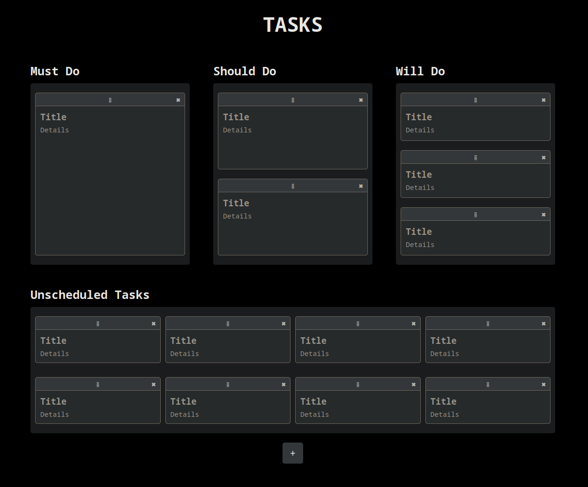

# TASKS
TASKS is a simple web-based task management application that allows users to
create, update, delete, and organise tasks across multiple categories.



TASKS uses Flask for the REST API and backend, and VanillaJS with SortableJS
for the front-end. State is stored in a SQLite database.

## Installation
First make a virtual environment and install the dependencies.
```
python -m venv .venv
source .venv/bin/activate
pip install -r requirements.txt
```

If you're working on development locally, you can run the debug server with:
```
flask run --debug
```

If you plan on serving this non-locally I'd suggest using a WSGI. I'm currently
using Gunicorn, which is included in the `requirements.txt`. You can run it
using:
```
gunicorn -w 2 -b 127.0.0.1:8000 app:create_app() --daemon
```

I'm using [Caddy][1] as reverse-proxy to expose the service on my homelab.

## Testing
Tests for the REST API are implemented using `pytest`. Use the following command
to run the tests and generate a coverage report:
```
pytest -v --cov=app --cov-report=html
```

[1]:https://caddyserver.com/